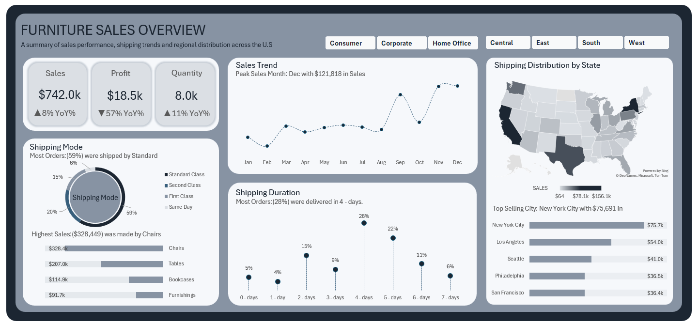

# 📊 Furniture Sales Performance Dashboard (Excel)


*A dynamic and interactive Excel dashboard designed to analyze U.S. furniture sales performance.*

---

## 📈 **Dashboard Preview**



---

## 📖 **Table of Contents**

* [📌 Project Overview](#-project-overview)
* [📂 About the Data](#-about-the-data)
* [🛠️ Tools & Skills Applied](#%EF%B8%8F-tools--skills-applied)
* [🔍 Key Questions This Dashboard Answers](#-key-questions-this-dashboard-answers)
* [💡 Key Insights & Findings](#-key-insights--findings)
* [🚀 How to Use This Dashboard](#-how-to-use-this-dashboard)
* [📊 Dashboard Features](#-dashboard-features)
* [⚙️ Analysis Workflow](#%EF%B8%8F-analysis-workflow)
* [🎨 Design Choices](#-design-choices)
* [❓ Frequently Asked Questions](#-frequently-asked-questions)
* [📧 Contact for Support](#-contact-for-support)
* [🤝 How to Contribute](#-how-to-contribute)
* [📜 License](#-license)

---

## 📌 **Project Overview**

This project demonstrates an **end-to-end data analysis workflow in Microsoft Excel**, transforming raw furniture sales data into an interactive, actionable dashboard. It provides a comprehensive view of sales performance across U.S. regions, covering essential steps from data cleaning to advanced visualization and dynamic filtering.

**Target Audience**: Sales Managers, Regional Directors, Inventory Planners, and Data Analysts looking for practical Excel dashboarding examples.

---

## 📂 **About the Data**

* **Source:** Real-world U.S. furniture sales data spanning from 2014 to 2017.
* **Data Schema:**
    ```
    Order_ID, Order_Date, Ship_Date, Ship_Mode, Customer_ID, Segment, City, State, Region, Product_Category, Sales, Profit, Quantity
    ```
* **Data Preparation:** Handled missing values, standardized date formats, and removed duplicate entries using Excel's Power Query for robust data integrity.
* **Limitations:** The dataset excludes product returns and represents pre-tax sales and profit figures.
* **Refresh Instructions:** To update the dashboard with new data, navigate to `Data → Refresh All` within Excel.

---

## 🛠️ **Tools & Skills Applied**

| **Category** | **Details** |
| :-------------------- | :----------------------------------------------------------------------- |
| **Data Preparation** | Power Query (Cleaning, Transformation, ETL)                              |
| **Analysis** | Pivot Tables, Pivot Charts, Calculated Fields (for KPIs & YoY growth)    |
| **Visualization** | Dynamic Titles, Map Charts, Trend Lines, Conditional Formatting (for KPIs)|
| **Interactivity** | Slicers (Region, Customer Segment), Drill-down Capabilities (Map Chart)  |
| **Design Principles** | Custom Layout, Strategic Color Themes, Dashboard Optimization for Readability and User Experience |

---

## 🔍 **Key Questions This Dashboard Answers**

This dashboard is engineered to provide clear answers to critical business questions:

1.  **"How are our furniture sales performing overall?"**
    * **Answer:** The dashboard’s **KPI cards** provide an immediate snapshot:
        * **Total Sales:** `$742.0k` (↑8% Year-over-Year)
        * **Total Profit:** `$18.5k` (↓57% Year-over-Year) - *Highlights a critical area for investigation.*
        * **Total Quantity:** `8.0k` (↑11% Year-over-Year)
    * **Where to look:** Prominently displayed in the top-left section of the dashboard.

2.  **"Which regions or customer segments drive the most revenue?"**
    * **Answer:** Utilize the **Region/Segment slicers** for dynamic filtering and comparison:
        * **Top Region:** `West` (contributes `34.04%` of total sales).
        * **Top Segment:** `Consumer` (generates higher sales value compared to Corporate).
    * **Pro Tip:** Click directly on the map chart to drill down into state-level performance for granular insights.

3.  **"When do we see peak sales periods, and what are the seasonal trends?"**
    * **Answer:** The **monthly sales trend line** clearly highlights:
        * **Best Months:** `December` (coinciding with the holiday season, with `$121.8k` in sales).
        * **Worst Month:** `February` (suggesting potential for targeted promotions during this period).
    * **Actionable Insight:** Align inventory stocking and marketing campaigns with these identified cyclical trends to optimize resource allocation.

4.  **"What’s our most popular shipping method, and how does it impact profitability?"**
    * **Answer:**
        * `Standard Class` is the most frequently used method (59% of orders), offering the lowest shipping cost but longest delivery time.
        * `Same Day` shipping leads to **6% lower profit margins** due to associated higher logistics costs.

5.  **"Which product categories or cities should we focus on for growth or improvement?"**
    * **Answer:**
        * **Top Category:** `Chairs` (generates a substantial `$328.4k` in sales).
        * **Underperforming Category:** `Furnishings` (generates only `$91.7k` in sales, indicating an area for strategic review).
        * **Top City:** `New York` (high order quantity of `720` but a relatively modest profit of `$5.3k`, suggesting potential for profit optimization).

---

## 💡 **Key Insights & Findings**

Based on the dashboard's analysis, several critical insights emerged:

1.  **Profitability Challenges:** Despite an increase in total sales and quantity, a **significant 57% drop in total profit** year-over-year highlights an urgent need to investigate cost structures, pricing strategies, or product mix.
2.  **Regional Dominance:** The **West region's strong performance** (34.04% of sales) indicates successful strategies that could potentially be replicated in other regions.
3.  **Consumer Segment Strength:** The **Consumer segment consistently drives higher sales**, warranting continued focus on understanding and catering to this customer group.
4.  **Shipping Cost Impact:** The **lower profitability of `Same Day` shipping** emphasizes the trade-off between speed and cost, requiring a balance for sustainable operations.
5.  **Product & City Discrepancies:** While `Chairs` are a revenue driver, the underperformance of `Furnishings` and the high volume but moderate profit in `New York` signal opportunities for targeted product development, marketing, or pricing adjustments.

---

## 🚀 **How to Use This Dashboard**

This dashboard is designed for various stakeholders to extract specific value:

### **For Sales Managers:**

* **Identify growth opportunities:** Use region/segment filters to allocate sales resources effectively.
* **Track Year-over-Year trends:** Hover over KPI cards to compare performance (e.g., 2016 vs. 2017).

### **For Inventory Teams:**

* **Anticipate demand:** Utilize monthly sales trends to proactively adjust stock levels and prevent stockouts or overstock.
* **Optimize shipping strategies:** Balance cost versus delivery speed based on the detailed shipping mode analysis.

### **For Executives:**

* **High-level performance overview:** Quickly grasp overall sales health and profit trends.
* **Presentation readiness:** Easily export visual elements (Right-click → Copy as Image) for reports and presentations.

---

## 📊 **Dashboard Features**

The dashboard is built with the following interactive and insightful components:

1.  **Key Metrics Section:**
    * **Total Sales, Profit, and Quantity:** Displayed with clear Year-over-Year percentage growth/decline indicators.
    * **KPI Cards:** Utilizes conditional formatting with up/down arrows to visually highlight performance trends.
2.  **Shipping Analysis:**
    * **Shipping Mode Distribution:** Bar/pie charts illustrate preferred shipping methods (e.g., dominance of Standard Class).
    * **Shipping Duration:** A histogram visualizes delivery days, showcasing average delivery times and identifying outliers.
3.  **Sales Trends Visualization:**
    * **Monthly Sales Line Chart:** Clearly identifies peak sales months (e.g., December) and periods of decline.
    * **Annotations:** Highlights key business events or promotions on the timeline for context.
4.  **Geographic Insights:**
    * **State-wise Sales Map:** A heatmap provides a visual representation of sales performance across U.S. states.
    * **Top Cities Table:** Ranks and displays the top 10 cities by order quantity, alongside their respective sales and profit figures.
5.  **Interactive Filters:**
    * **Slicers:** Intuitive slicers for filtering data by `Region` (East/West/Central/South) and `Customer Segment` (Consumer/Corporate/Home Office).
    * **Dynamic Titles:** Dashboard titles automatically update based on selected filters, enhancing user experience.

---

## ⚙️ **Analysis Workflow**

My process for creating this dashboard involved:

1.  **ETL (Extract, Transform, Load):** Utilized Power Query to extract raw data, perform cleaning and necessary transformations, and load it into a structured format suitable for analysis.
2.  **Pivot Table Calculations:** Developed comprehensive pivot tables to calculate key metrics, including Year-over-Year growth percentages (e.g., `(Current Year Sales - Prior Year Sales) / Prior Year Sales`).
3.  **Visualization Integration:** Linked various charts directly to the pivot tables, ensuring all visuals update in real-time with filter selections.

---

## 🎨 **Design Choices**

The dashboard's design emphasizes clarity, readability, and user experience:

* **Color Palette:** Employed neutral background tones with strategic accent colors to highlight key performance indicators and guide user focus.
* **Layout:** Utilized a grid-based layout for logical organization, prioritizing critical metrics in the top-left section to align with natural F-pattern reading habits.
* **Fonts:** Chose `Aptos Narrow` for overall readability and used bold headers to establish clear visual hierarchy.

---

## ❓ **Frequently Asked Questions**

* **"Why do some states show zero sales on the map?"**
    * **Answer:** This indicates that the provided dataset may not contain sales data for all U.S. states, or currently active filters may be excluding them. Please check your selected filters or the original data scope.
* **"How often should we update this dashboard?"**
    * **Answer:** It is recommended to update this dashboard monthly, aligning with typical accounting and reporting cycles, to ensure the data remains current and relevant.
* **"Can we add competitor benchmarking?"**
    * **Answer:** Absolutely! If competitor sales data is available (ideally in CSV format), I can extend the Power Query pipeline to integrate and visualize this for comparative analysis.
* **"Why is my map chart not working?"**
    * **Answer:** Ensure you have Excel’s **Geography Data Type** enabled. You can usually find this feature under the `Data` tab in Excel.

---

## 📧 **Contact for Support**

* **Questions or Feedback?** Feel free to reach out via  [Email](mailto:nelson.mforbi@gmail.com) or open a [GitHub Issue](https://github.com/your-repo/issues) on this repository.

---

## 🤝 **How to Contribute**

* **Bug Reports:** Please report any issues or bugs encountered via the [Issues](https://github.com/your-repo/issues) section.
* **Feature Suggestions:** We welcome suggestions for design improvements, additional metrics, or new functionalities.

---

## 📜 **License**

This project is licensed under the MIT License. See the [LICENSE](LICENSE) file for more details.
